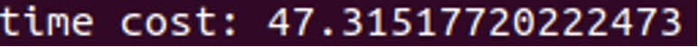
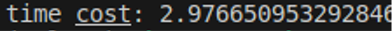
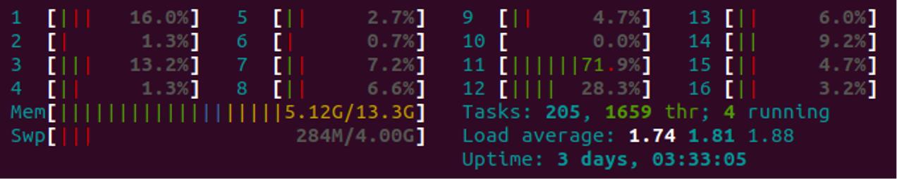
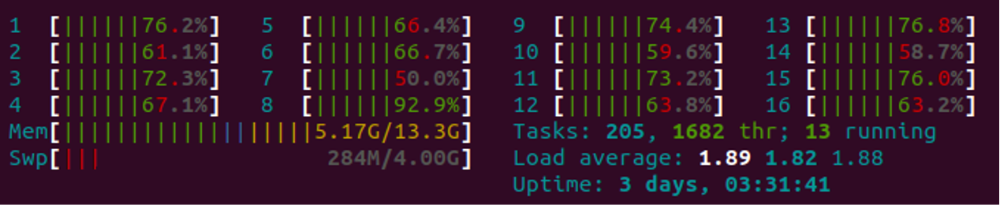
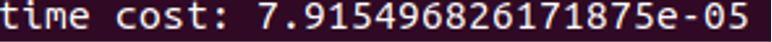
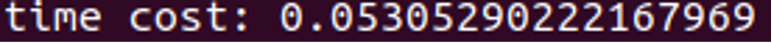

# TEAM 04 ONNX-MLIR
## Members
| Name | Student ID |
| ---- | ----- | 
| 郑扬  | PB21051134 |
| 张昊鹏 |PB21050991 |

## 仓库链接

https://github.com/ZhangHaopeng-Dino/2023fall-NSec-teamworks

## 实验选题
- 了解mlir框架，对基于mlir框架的深度学习编译器onnx-mlir进行生态调研和性能测评，并且分析onnx-mlir的执行逻辑，分析其中的优点和不足，提出相应的优化手段

## 设计

- 调查mlir框架和onnx模型格式，理解各自的执行逻辑和内容
- 深读onnx-mlir的论文和onnx-mlir项目，了解onnx-mlir的编译步骤、已经实现的优化和相应功能
- 使用onnx-mlir和mlir将.onnx模型编译为.so，并且使用对应的runtime运行时库加载模型和图片进行推理，将onnx-mlir和python中的onnx-runtime库加载同样的数据集和模型进行推理，对比两者之间的推理结果、占用资源和推理效率，分析其中的区别和原因
- 根据分析得到的可能原因对运行过程进行梳理。
  - 查看onnx-mlir的中间表示输出，得到onnx-mlir并未进行的pass优化
  - 编译特定功能的模型（比如只含有两个tensor相加的函数），分析onnx-mlir的输出，得到onnx-mlir推理效率低的原因
  - 提出相应的可能可以优化的切入点

- 尝试根据提出的优化写一种dialect和对应的pass接入mlir框架之中

## 具体实现和测评

### 训练基础网络

训练了一个针对minist数据集(手写数字识别数据集，低分辨率数字图像组成)的lenet(典型卷积网络)模型，并将其导出为.onnx模型(SouceCode/onnx-mlir/lenet.onnx)。

### 获取mlir框架的编译结果

1. 参考项目[onnx/onnx-mlir](https://github.com/onnx/onnx-mlir),使用onnx-mlir将lenet.onnx模型编译为lenet.onnx.mlir的中间表示(SouceCode/onnx-mlir/lenet.onnx.mlir之中)。其中环境搭建基于onnx-mlir Prebuild Container(Docker Env)。
2. 将lenet.onnx.mlir使用mlir编译为lenet.so。环境为郑扬在个人电脑搭建的mlir环境，使用ninja构建。(SourceCode/onnx-mlir/lenet.so)

### 运行网络并获取结果

在AMD CPU(8core 6800H)平台进行相关测试

1. 使用Pyruntime.so运行时库加载lenet.so和minist数据集中的测试集，推理得到对应的结果。实现上使用相应的amd64 cpu运行时库(PyRuntime.cpython-38)，作用是读取图片并将图片加载到.so的入口处，加载模型和图片并进行推理。(SourceCode/onnx-mlir/so-loarder.py)

2. 使用onnx-runtime加载lenet.onnx和minist数据集中的测试集，推理得到对应的结果。(SourceCode/onnx-mlir/onnx-loarder.py)

3. 分析其中推理结果，推理效率，加载效率和资源占用，得出分析结论并尝试得到可能导致差异的原因。

   - 推理结果上：onnx-mlir和onnx-runtime对相同图片的推理结果完全相同。这说明onnx-mlir编译出的模型并没有损坏，每个隐藏层的权重等信息被完好地保存到了.so中。这证明了通过onnx-mlir生成mlir中间表示的过程是正确且无损的。

   - 推理效率上：比较两者的运行效率发现.so的推理速率相比于使用onnx-runtime库来说差距非常大（约16倍差距）。(上图为onnx-mlir)

     

     

   - 资源占用上：onnx-runtime运行时占用了800%的核心资源，而onnx-mlir的结果占用100%的核心资源。这可以认为生成so的过程中并没有针对多核心cpu进行并行优化。(上图为onnx-mlir)

     

     

   - 加载速率上：onnx-mlir的so模型加载速率明显快。可以认为是因为.so文件已经是很层次的文件，所以加载比需要在加载时进行一些处理和优化的onnx-runtime速度快很多是合理的。(上图为onnx-mlir)

     

     

4. 得出可能的使效率较低的原因

   1. onnx-mlir运行时只占用cpu的一个核(100%)，说明onnx-mlir并没有进行并行化处理
   2. mlir-onnx框架缺少针对模型的pass优化

5. 使用onnx-mlir将lenet.onnx编译为lenet.onnx.ir，得到ONNX dialect和KRNL dialect每一层的中间表示，分析其中做了的优化和缺少的优化，提出相应可能进行的pass。根据ONNX dialect的中间表示可以知道onnx-mlir没有进行特定针对模型的优化，比如算子之间的融合这类优化并未实现。后续查阅资料后发现onnx-mlir支持的算子数量远少于onnx本身支持的算子数量。比如对非极大值抑制算子NonMaxSuppression进行编译会导致编译失败。

### 编写测试程序

- 人为编写ADD(tensor a, tensor b){表示两张三通道图片相加}的.onnx进行编译，得到每一层dialect并进行分析(SourceCode/dialect-output/)。

## 分工及贡献

- 郑扬（60%）：阅读onnx-mlir论文和onnx-mlir源码了解onnx-mlir的实现过程。训练了lenet.onnx模型，结合onnx-mlir和mlir实现lenet.onnx模型的编译，对比onnx-mlir和onnx-runtime的运行结果并分析两者的区别，根据onnx-mlir的中间表示输出总结了onnx-mlir缺少的优化并提出相应的优化手段。完成ppt和报告的框架。
- 张昊鹏（40%）：了解mlir框架和其基本Dialect的实现。了解onnx-mlir项目。协助郑扬进行基础模型的训练和运行，对现象进行分析得出同一台设备中mlir效率较低的可能原因。对得到的中间表示，进行分析讨论并提出优化手段。完成ppt和报告的编写。

## 实验过程记录

1. 了解mlir和onnx的实现，配置实验环境。分为本机环境和已经预搭建的docker容器。以mlir-onnx为切入点了解mlir编译框架的生态和潜力。
2. 使用minist训练集训练了一个lenet.onnx，成功利用onnx-mlir和mlir实现lenet.onnx模型的编译并且在amd64 cpu机器上使用lenet.so推理minist测试集，对比python的onnx-runtime库加载lenet.onnx模型推理，对比两者得出区别，**对应SourceCode/onnx-mlir**
3. 阅读onnx-mlir源码了解了onnx-mlir的实现逻辑，根据onnx-mlir的两个dialect实现提出了onnx-mlir可能没有进行优化的点，并编写了一个ADD.onnx和分析中间表示输出对自己的想法进行了验证，**对应SourceCode/dialect-output**
4. (郑扬)尝试根据验证得出的没有优化的点尝试编写新的dialect和pass，但是没有成功
5. 根据实验内容编写实验报告
6. 根据了解的onnx-mlir运行机制、前面的实验结果等内容制作了PPT，**对应SourceCode/ppt**

## 相关链接
- onnx-mlir论文:https://arxiv.org/abs/2008.08272
- onnx-mlir项目:https://github.com/onnx/onnx-mlir/tree/main